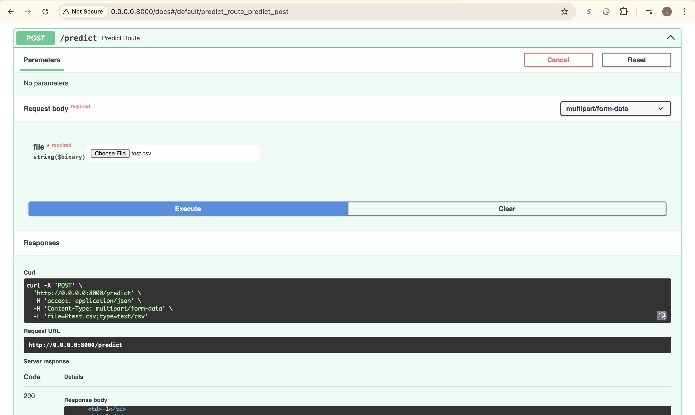

# 🔐 SafeNet: Intelligent Website Safety Classification

**SafeNet** is a machine learning-powered web application that predicts whether a website is **Safe** or **Malicious** using phishing detection data. Built with a modular architecture and MLOps best practices, this project leverages **FastAPI**, **MLflow**, **AWS (S3 & EC2)**, and **MongoDB** to deliver secure, scalable, and fast inference for real-time web classification.

---

## 🚀 Key Features

* **Website Safety Classification**: Upload URLs in `.csv` format and get predictions on their safety.
* **ML Model Tracking**: Uses **MLflow** to track experiment metrics and model versions.
* **Cloud-Hosted**: Model and artifacts hosted on **AWS S3** and deployed via **EC2**.
* **FastAPI Backend**: Provides a blazing-fast and lightweight REST API.
* **Modular Pipeline**: Includes configurable data ingestion, validation, transformation, and training modules.
* **Logs & Monitoring**: Integrated logging and output reports.

---

## Project Structure

```
.
├── app.py                       # FastAPI application
├── main.py                     # Orchestrates training pipeline
├── prediction_output/          # Stores prediction results
├── final_model/                # Contains trained model and preprocessor
├── Network_Data/               # Raw phishing data
├── notebooks/                  # EDA & training notebooks
├── Networksecurity/            # Core package for pipeline
│   ├── components/             # Data ingestion, validation, transformation, model trainer
│   ├── Logging/, Exception/    # Custom logging and exception handling
│   ├── Utils/, Constant/       # Utility functions and constants
│   ├── Pipeline/               # Training pipeline class
├── data_schema/schema.yaml     # Feature schema definition
├── push_data.py                # MongoDB data loader
├── setup.py                    # Project setup
├── Dockerfile.csv              # (To be renamed) Docker configuration
├── .github/workflows/          # CI/CD with GitHub Actions
```

FastAPI:



---

## How It Works

1. **Data Loading**: Push phishing dataset to MongoDB.
2. **Training**: Trigger model training via `/train` endpoint or CLI.
3. **Prediction**: Upload a CSV file at `/predict` to classify URLs.
4. **Output**: Get predictions displayed in a web table and saved to `output.csv`.

---

## Tech Stack

* **FastAPI** – API framework
* **MLflow** – Model tracking
* **Scikit-learn** – ML modeling
* **MongoDB** – NoSQL database
* **AWS S3 & EC2** – Cloud hosting
* **Docker** – Containerization (optional)
* **GitHub Actions** – CI/CD

---

## Getting Started

### 1. Clone the Repo

```bash
git clone https://github.com/your-username/network-security.git
cd network-security
```

### 2. Install Dependencies

```bash
pip install -r requirements.txt
```

### 3. Set Up Environment

Create a `.env` file with:

### 4. Run the API

```bash
python app.py
```

Visit: [http://0.0.0.0:8000/]

---

## 📤 Sample Prediction

* Upload a CSV file with website feature data (e.g., `test.csv`) at the `/predict` endpoint.
* View predictions directly in a browser-rendered table.
* **The prediction response from the ML model and FastAPI is stored in `prediction_output/output.csv`.**

---

## 📊 Model Tracking

* Start MLflow UI:

  ```bash
  mlflow ui
  ```

---

